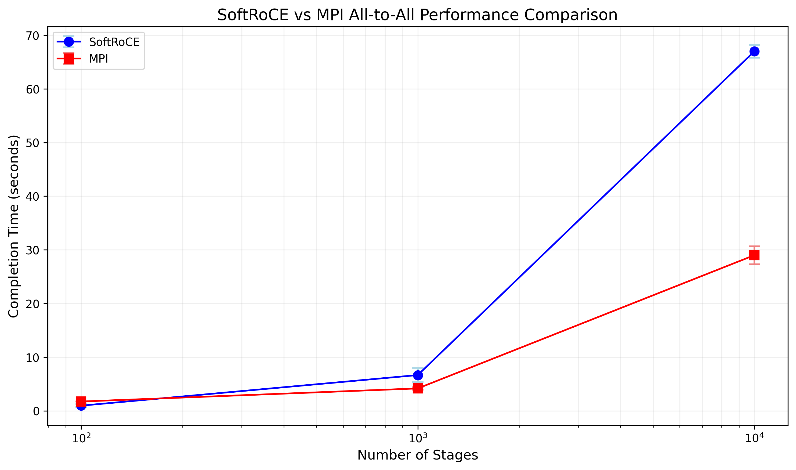

# RDMA Communication library for sequential all-to-all communication

This project covers the implementation of an RDMA communication library that will mainly expose a sequential all-to-all broadcast primitive. The functionality and performance of the library will be tested on sample applications in an environment with multiple VMs that will communicate using RXE/ibverbs. Our implementation will be compared to other communication/synchronization libraries such as MPI.

## Problem Description

In modern machine learning distributed training ecosystems, efficient node communication represents an important performance bottleneck. With techniques such as model and data parallelism, GPUs on different nodes need to leverage efficient algorithms for coordination and data sharing. Ultimately one of the bottlenecks is the network bandwidth, which can be addressed by using advanced network technologies and NICs such as RDMA.

Besides AI/ML, there are also several other use cases such as: High-Performance Computing (HPC), Big Data Analytics and Cloud Computing.

Sequential all-to-all communication patterns emerge as a optimization strategy, particularly in scenarions with:

* Memory-constrained GPU clusters

* Hierarchical network topologies

* Bandwidth-limited interconnects

* Large model synchronization requirements

For this project I will provide a communication library optimized for sequential all-to-all communication. The library will expose an all-to-all broadcast primitive (basically gather followed by a scather) for applications to use and synchronize their data. Some of the characteristics of sequentially exchanged data, one pair at a time, in a strict order:

* Data transfer happens in a serialized manner

* Lower peak bandwidth utilization

* Predictable network load

* Lower memory pressure

Compared to other communication strategies (parallel all-to-all, incast communication) it has the following pros:

* Lower peak memory requirements

* Easier to debug/implement

* More predictable network behavior

While there are also several cons:

* Slower overall communication

* Reduced parallelism

* Lower aggregate bandwidth utilization

## Project Plan/Implementation

There are several steps involved in the creation, validation and comparing the library with other alternatives.

### 1. Development environment setup

The library and test applications will be developed in a virtual environment consisting of several VMs that can communicate through RDMA over SoftRoCE. After configuring the VM administration software and enable NVME on the machines, at least 3 VMs should be able to ping each other using ibverbs primitives.

I've managed to setup an environment with 3 Ubuntu 24.04 VMs that can speak SoftRoCE. These were configured mainly by:

- Installing the User-Space SoftRoCE libraries (found at https://github.com/linux-rdma/rdma-core.git):

- Installing the ibverbs headers/libraries

- Creating a RXE Interface

### 2. Sequential all-to-all library implementation

The library was implemented in C and on a high level it provides the following features:

* It uses InfiniBand Verbs API for RDMA operations

* Implements connection management and QP setup

* Provides optimized all-to-all primitive

* Handles memory registration and protection domains

* Includes proper resource cleanup

I will go over the main implementation points of the library.

#### RDMA Context Initialization 

```
rdma_context* rdma_init(const char *ip, int port, size_t buf_size, bool is_server)
```

This function initializez the RDMA context by setting up the InfiniBand device, creating Protection Domain (PD), creating Completion Queue (CQ) and allocating and registering memory regions.

#### Connection Management

The library supports both client and server roles.

```
int rdma_connect_peer(rdma_context *ctx, const char *peer_ip, int peer_port)  // Client side
int rdma_accept_peer(rdma_context *ctx)  // Server side
```

These functions handle QPs creation, QP state transition and connection information exchange over TCP

#### Basic Operations

```
int rdma_send(rdma_context *ctx, int peer_idx, const void *data, size_t len)
int rdma_recv(rdma_context *ctx, int peer_idx, void *data, size_t max_len)
```

Only the send (and it's counterpant recv) RDMA operation was implemented, as it was the only one suited for our sequential/synchronous context. The other operations (read and write) are better fitting for a parallel/asynchronous approach

#### All-to-All Implementation

The rdma_sequential_alltoall function is of particular interest. Initially I've tried a peer-to-peer approach for it, maybe it's possible but I've found it difficult to make it work. In the end I've chosen the server/client approach. Here's how it works:

```
int rdma_sequential_alltoall(rdma_context *ctx, const void *send_buf, void *recv_buf, size_t msg_size)
```

On the server, the all-to-all operation follows a two-phase protocol, first it has a gather phase, where the clients send data to the server:

```
// Post receives from all clients
for (int i = 0; i < ctx->num_peers; i++) {
    struct ibv_sge recv_sge = {
        .addr = (uint64_t)(rdma_recv_buf + (i * msg_size)),
        .length = msg_size,
        .lkey = ctx->mr->lkey
    };
    // Post receive WR
}

// Wait for all receives
for (int i = 0; i < ctx->num_peers; i++) {
    // Wait for completion
}
```

Then it has a broadcast phase, where the server and clients messages are combined and sent to all clients:

```
// Combine messages
// First server's message
int pos = snprintf(temp_buf, BUFFER_SIZE, "%s", (char*)send_buf);
// Then each client's message
for (int i = 0; i < ctx->num_peers; i++) {
    pos += snprintf(temp_buf + pos, BUFFER_SIZE - pos, "; %s", 
                   rdma_recv_buf + (i * msg_size));
}

// Send combined message to all clients
for (int i = 0; i < ctx->num_peers; i++) {
    // Post send WR with combined message
}
```

The clients sends its data to the server, than waits for the gathered results from the server:

```
// Post receive for combined message
struct ibv_sge recv_sge = {
    .addr = (uint64_t)rdma_recv_buf,
    .length = BUFFER_SIZE,
    .lkey = ctx->mr->lkey
};

// Send our message to server
struct ibv_sge send_sge = {
    .addr = (uint64_t)rdma_send_buf,
    .length = msg_size,
    .lkey = ctx->mr->lkey
};
```

#### Resources cleanup

The library also provides cleanup functionality:

```
int rdma_disconnect_peer(rdma_context *ctx, int peer_idx)
void rdma_cleanup(rdma_context *ctx)
```

### 3. Benchmarks/Comparation with MPI

#### Server/Client test apps

For testing the all to all broadcast I've implemented a test client/server application. The clients connect to the server, and wait for a signal from the server before starting the broadcast. Next, the server and the client repeat an all to all broadcast for some stages. The primitive seems to work correctly, the logic of the app works as intended.

#### Comparison with MPI

For comparison purposes, I've implemented an MPI app that uses the MPI_Alltoall method. The logic is mainly the same as the SoftRoCE app, the only difference is that MPI is used instead.

For both examples I've timed the experiments using the Linux ```time``` command. The broadcast was done 100 times, then 1000 times, then 10000 times. The completion times for the SoftRoCE and MPI apps are as follows:



for a lower number of broadcasts (around/under 100) the SoftRoCE implementation performs better than MPI just by a small factor. For the 1000 stages run the MPI implementation outperforms SoftRoCE by a still small grade. For the 10000 stages run though, MPI greatly outperforms SoftRoCE.

Overall, SoftRoCE and MPI perform similar for a smaller number of all to all broadcasts, but for higher numbers of magnitude MPI performs better. 

We also have to take into account that this is a starter implementation of an SoftRoCE library, and such is not as tuned and production tested as MPI. It would be interesting to see how RoCEv2 performs using the library but currently I don't have the means to do that.

## Conclusions

Throughout this project, we have explored RDMA communication through a custom implementation using SoftRoCE, comparing it with MPI for all-to-all operations. For smaller workloads (100 stages), our RDMA implementation showed competitive performance with MPI, while at larger scales MPI demonstrated superior performance. This gap at scale likely reflects the maturity of MPI's optimization rather than limitations of RDMA technology itself.

The advantages of our approach using RDMA and SoftRoCE include cost-effectiveness (no specialized hardware required), flexibility in implementing custom communication patterns, and reduced CPU overhead through direct memory access. While our sequential implementation may not match MPI's optimized performance at scale, it provides a solid foundation for experimenting with high-performance networking and could be further enhanced through parallel communication patterns and buffer management optimization.

These results demonstrate that SoftRoCE offers a viable path for organizations to explore RDMA capabilities without specialized hardware investment, particularly for applications with moderate scaling requirements.